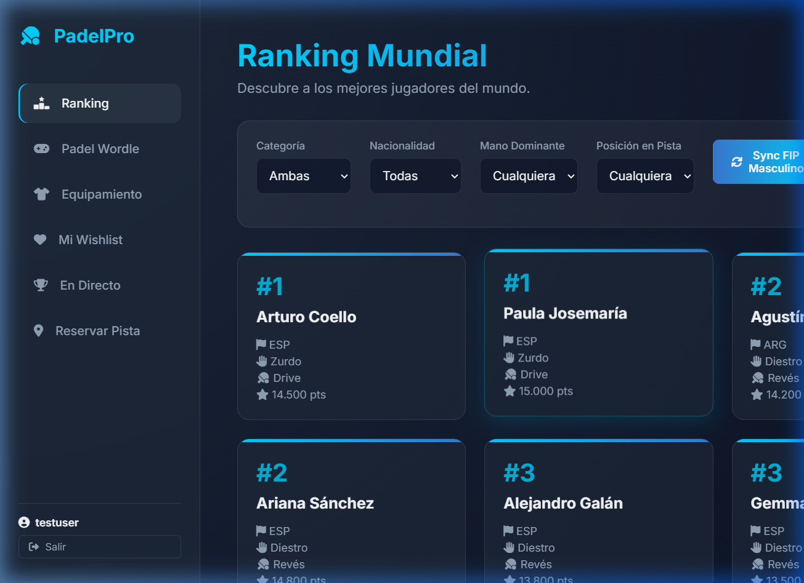
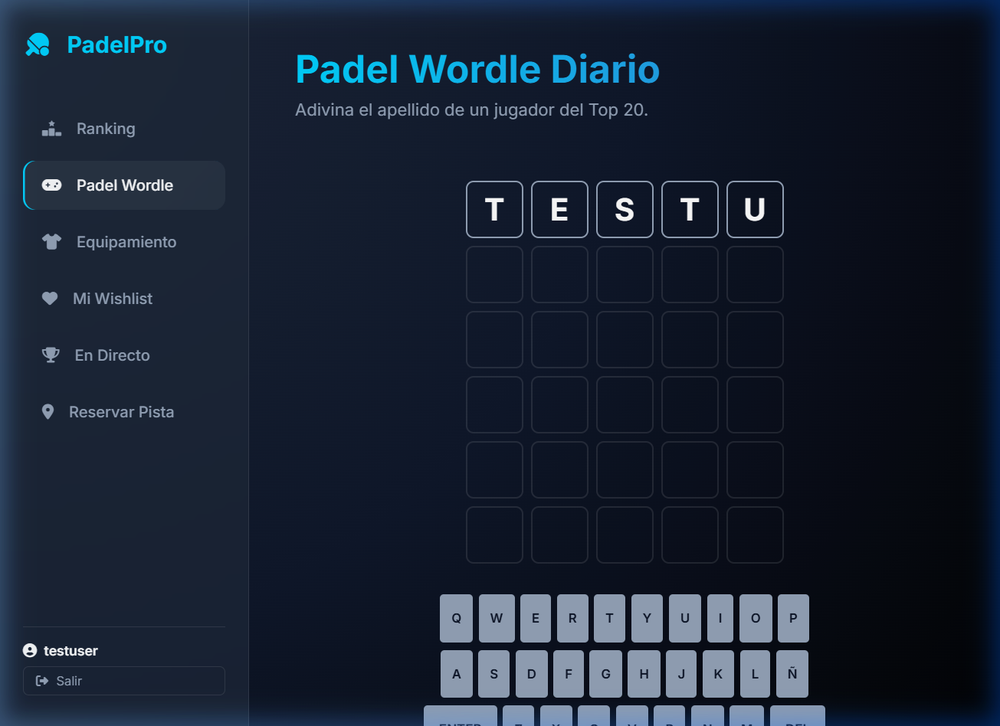
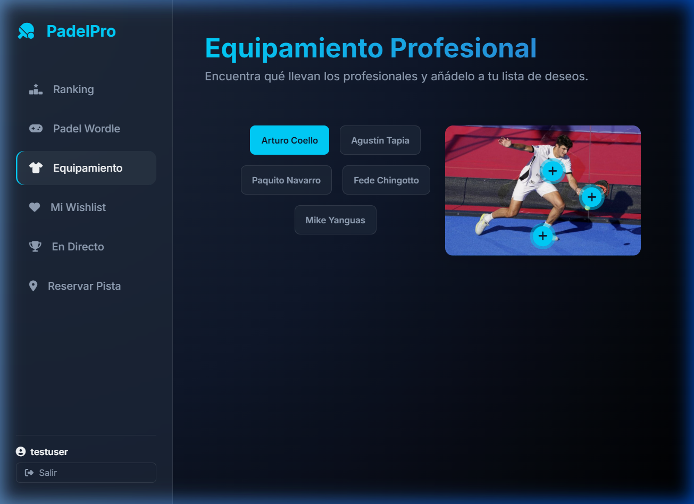
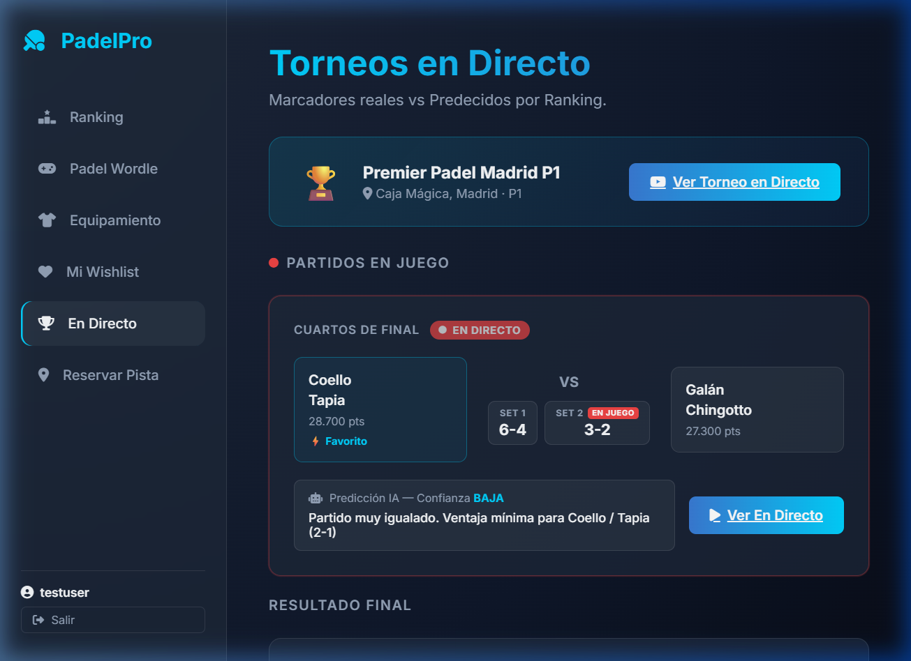
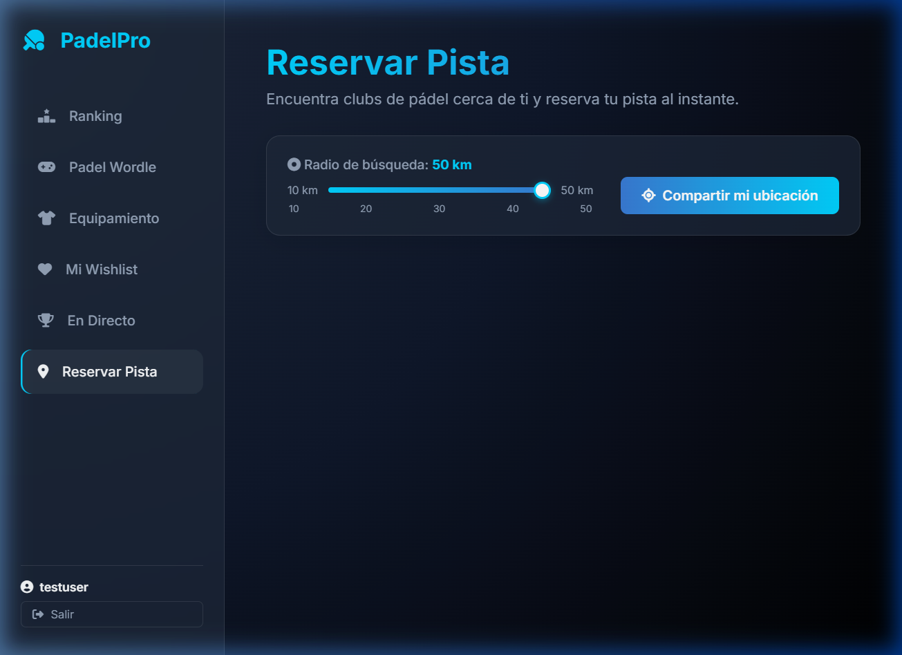
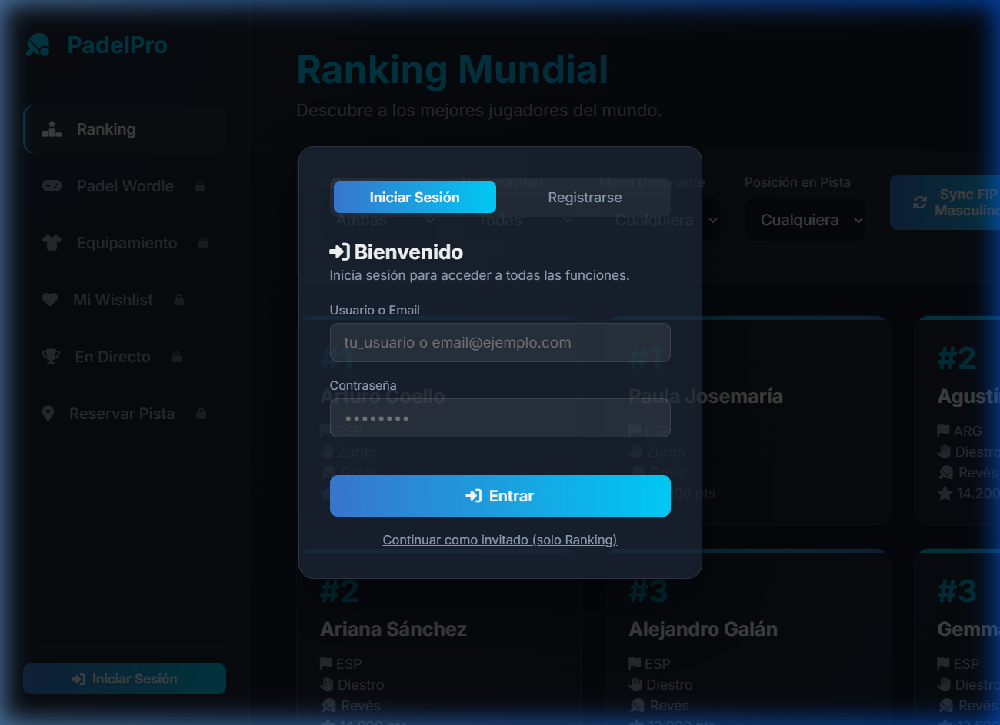

# 🏓 PadelPro App

**Proyecto Intermodular · 2º DAM · Curso 2025/2026**  
Profesora: María Sierra Escalera Pérez

> Aplicación web full-stack para la gestión y seguimiento del mundo del pádel profesional: ranking mundial en tiempo real, torneos en directo con predicción IA, reserva de pistas por geolocalización, equipamiento interactivo y juego Wordle diario con apellidos de jugadores.

---

## 📋 Índice

1. [Descripción del proyecto](#-descripción-del-proyecto)
2. [Tecnologías utilizadas](#-tecnologías-utilizadas)
3. [Requisitos previos](#-requisitos-previos)
4. [Instalación paso a paso](#-instalación-paso-a-paso)
5. [Ejecución](#-ejecución)
6. [Configuración](#-configuración)
7. [Funcionalidades implementadas](#-funcionalidades-implementadas)
8. [Funcionalidades pendientes](#-funcionalidades-pendientes)
9. [Problemas conocidos](#-problemas-conocidos)
10. [Capturas de pantalla](#-capturas-de-pantalla)
11. [Autor y contacto](#-autor-y-contacto)

---

## 📖 Descripción del proyecto

**PadelPro App** es una Single Page Application (SPA) que sirve el frontend directamente desde un backend Spring Boot. El sistema permite a los usuarios:

- Consultar el **ranking mundial FIP** de pádel masculino y femenino con filtros avanzados.
- Ver **torneos en directo** con marcadores en tiempo real y **predicciones de resultado** basadas en el ranking de los jugadores.
- Encontrar **clubs de pádel cercanos** usando geolocalización del navegador, con radio de búsqueda ajustable de 10 a 50 km.
- Explorar el **equipamiento profesional** de los mejores jugadores con hotspots interactivos y lista de deseos personal.
- Jugar al **Padel Wordle** diario, adivinando el apellido de jugadores del Top 20.
- Gestionar una **cuenta de usuario** con registro e inicio de sesión seguros.

---

## 🛠 Tecnologías utilizadas

### Backend
| Tecnología | Versión | Uso |
|---|---|---|
| Java | 21 (LTS) | Lenguaje principal del backend |
| Spring Boot | 3.4.0 | Framework web y servidor embebido Tomcat |
| Spring Data JPA | 3.4.0 | ORM y acceso a base de datos |
| Hibernate | 6.x | Implementación JPA |
| H2 Database | 2.x | Base de datos en memoria (desarrollo) |
| Maven | 3.9.x | Gestión de dependencias y build |

### Frontend
| Tecnología | Versión | Uso |
|---|---|---|
| HTML5 | — | Estructura SPA |
| CSS3 (Vanilla) | — | Estilos, animaciones, glassmorphism |
| JavaScript (ES6+) | — | Lógica de cliente, fetch API |
| Font Awesome | 6.4.0 | Iconografía |
| Google Fonts (Inter) | — | Tipografía principal |

### APIs externas
| API | Uso |
|---|---|
| Navegador Geolocation API | Obtener coordenadas del usuario para búsqueda de clubs |
| Google Maps URL API | Enlace directo a ubicación de clubs en mapa |
| FIP Ranking (scraping) | Sincronización del ranking mundial oficial |

---

## ✅ Requisitos previos

Antes de instalar el proyecto asegúrate de tener instalado:

- **Java Development Kit (JDK) 21** o superior  
  Verifica con: `java -version`
- **Maven 3.9+** (o usar el wrapper `mvnw` incluido en el proyecto)  
  Verifica con: `mvn -version`
- **Git** para clonar el repositorio  
  Verifica con: `git --version`
- Navegador moderno con soporte para ES6 (Chrome 90+, Firefox 90+, Edge 90+)

> **No se necesita** instalar Node.js, una base de datos externa, ni ningún servidor adicional. El servidor Tomcat y la base de datos H2 están embebidos en Spring Boot.

---

## 📦 Instalación paso a paso

### 1. Clonar el repositorio

```bash
git clone https://github.com/alejandroferrersfc-cell/padel-App.git
cd padel-App
```

### 2. (Opcional) Verificar el JDK disponible

```bash
java -version
# Debe mostrar: openjdk 21.x.x o superior
```

### 3. Compilar el proyecto

En **Windows**:
```cmd
.\mvnw.cmd clean compile
```

En **Linux / macOS**:
```bash
./mvnw clean compile
```

---

## ▶️ Ejecución

### Modo desarrollo (recomendado)

**Windows:**
```cmd
.\mvnw.cmd spring-boot:run
```

**Linux / macOS:**
```bash
./mvnw spring-boot:run
```

Una vez iniciado, abrir el navegador en:

```
http://localhost:8080
```

El servidor tarda aproximadamente **15-30 segundos** en arrancar y poblar la base de datos con los jugadores iniciales.

### Modo producción (JAR)

```bash
# Compilar JAR
.\mvnw.cmd clean package -DskipTests

# Ejecutar JAR
java -jar target/padel-backend-0.0.1-SNAPSHOT.jar
```

---

## ⚙️ Configuración

El archivo de configuración principal es `src/main/resources/application.properties`.

### Variables de entorno / propiedades importantes

| Propiedad | Valor por defecto | Descripción |
|---|---|---|
| `server.port` | `8080` | Puerto del servidor HTTP |
| `spring.datasource.url` | `jdbc:h2:mem:padeldb` | URL de la base de datos H2 en memoria |
| `spring.h2.console.enabled` | `true` | Activa la consola web de H2 |
| `spring.jpa.hibernate.ddl-auto` | `create-drop` | Recrea el esquema en cada inicio |

### Consola H2 (base de datos)

Disponible en: `http://localhost:8080/h2-console`

| Campo | Valor |
|---|---|
| JDBC URL | `jdbc:h2:mem:padeldb` |
| Usuario | `sa` |
| Contraseña | *(vacía)* |

### Credenciales de prueba (aplicación)

La base de datos se puebla automáticamente al iniciar. Para probar el sistema de autenticación, **registra una nueva cuenta** desde la pantalla de login, o usa:

| Campo | Valor |
|---|---|
| Usuario | `demo` |
| Contraseña | `demo123` |

> Si el usuario demo no existe, regístrate directamente en la app — el proceso tarda menos de 10 segundos.

---

## ✨ Funcionalidades implementadas

### 🏆 Ranking Mundial FIP
- [x] Visualización del ranking masculino y femenino en tarjetas
- [x] Filtros por categoría, nacionalidad, mano dominante y posición en pista
- [x] Sincronización con el ranking oficial FIP (botones Sync)
- [x] Optimización de rendimiento: máximo 400 jugadores renderizados

### 🎮 Padel Wordle Diario
- [x] Juego de adivinanza del apellido de un jugador del Top 20
- [x] Teclado virtual interactivo con retroalimentación cromática
- [x] Estados: correcto (verde), presente (amarillo), ausente (gris)
- [x] Palabra diferente cada día (basada en fecha)

### 👕 Equipamiento Profesional
- [x] Galería de 5 jugadores profesionales con sus equipaciones
- [x] Hotspots interactivos con tooltip de información de cada prenda
- [x] Selector de jugador para cambiar entre perfiles
- [x] Botón "Añadir a Wishlist" en cada hotspot

### ❤️ Mi Wishlist
- [x] Lista de deseos persistente en la sesión
- [x] Visualización de ítems guardados en grid
- [x] Posibilidad de eliminar elementos

### 🔴 Torneos En Directo
- [x] Detección automática de torneos activos según fecha
- [x] Banner prominente con enlace directo al stream del torneo
- [x] Tarjetas de partidos con marcador por sets
- [x] Badge animado "EN DIRECTO" para partidos en juego
- [x] Estado de cada partido: en juego / finalizado / próximamente
- [x] **Predicción IA** con nivel de confianza (alta/media/baja) basada en puntos del ranking
- [x] Botón de redirección al stream o highlights

### 📍 Reservar Pista
- [x] Geolocalización del usuario mediante API del navegador
- [x] **Radio de búsqueda ajustable**: slider de 10 a 50 km (pasos de 10)
- [x] 13 clubs mock con información real: nombre, teléfono, comodidades, disponibilidad
- [x] Filtrado y ordenación de clubs por distancia al usuario
- [x] Enlace a Google Maps con coordenadas del club
- [x] Modal de reserva con selector de franja horaria
- [x] Toast de confirmación al reservar

### 🔐 Autenticación
- [x] Registro de usuario con validación de campos
- [x] Login con nombre de usuario o email
- [x] Modo invitado (acceso sin cuenta)
- [x] Sesión persistente en localStorage
- [x] Logout y visualización del usuario activo en sidebar

---

## 🚧 Funcionalidades pendientes

- [ ] Reserva real de pistas en base de datos (actualmente mock)
- [ ] Perfil de usuario editable (foto, preferencias)
- [ ] Notificaciones push de torneos próximos
- [ ] Historial de reservas del usuario
- [ ] Modo claro / oscuro con selector
- [ ] Soporte responsive completo para móvil
- [ ] Despliegue en servidor en la nube (Render, Railway, etc.)

---

## 🐛 Problemas conocidos

| Problema | Impacto | Estado |
|---|---|---|
| El ranking tarda en cargar si hay muchos jugadores (>500) | Bajo — se muestra spinner | Mitigado con límite de 400 |
| La sincronización FIP puede fallar si el scraping externo cambia | Medio — los datos locales siguen disponibles | Pendiente de API oficial |
| Los datos del ranking de la sección "En Directo" son mock | Bajo — funcional para demo | Pendiente de API de torneos |
| Los clubs de pistas son datos simulados | Bajo — funcional para demo | Pendiente de API de clubs |
| La H2 es en memoria: los datos se pierden al reiniciar | Bajo — se repobla automáticamente | Diseño de desarrollo |

---

## 📸 Capturas de pantalla

### 🏆 Ranking Mundial


### 🎮 Padel Wordle


### 👕 Equipamiento Profesional


### 🔴 Torneos En Directo


### 📍 Reservar Pista


### 🔐 Autenticación


---

## 👤 Autor y contacto

| Campo | Valor |
|---|---|
| **Nombre** | Alejandro Ferrer |
| **Curso** | 2º DAM — Proyecto Intermodular 2025/2026 |
| **GitHub** | [@alejandroferrersfc-cell](https://github.com/alejandroferrersfc-cell) |
| **Repositorio** | [github.com/alejandroferrersfc-cell/padel-App](https://github.com/alejandroferrersfc-cell/padel-App) |

---

<p align="center">
  <i class="fa-solid fa-table-tennis-paddle-ball"></i> para el Proyecto Intermodular 2025/2026
</p>
